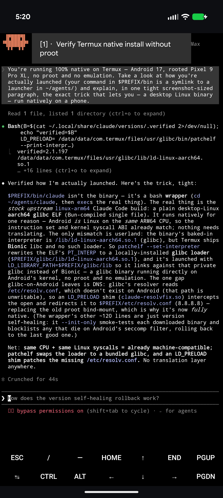
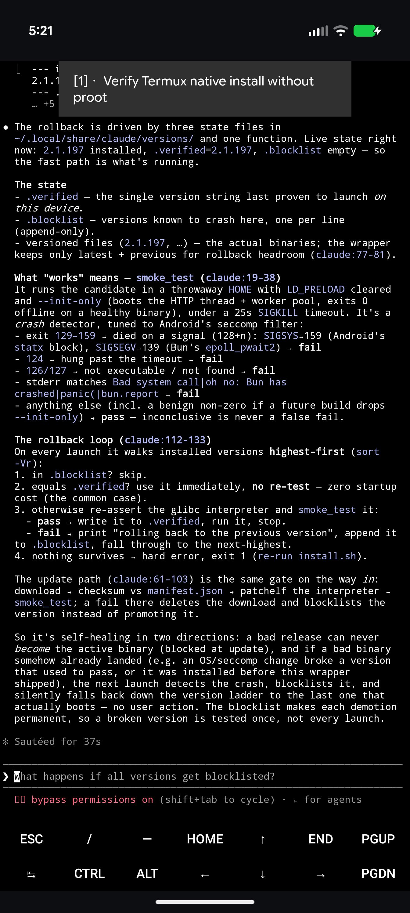

# claude-code-termux-native

Run **Claude Code fully native on Termux** (Android · aarch64) — **no proot, no chroot, no container.**

Claude Code ships as a glibc binary. On Termux the usual way to run it is to wrap it in `proot`, purely to satisfy one detail: Claude reads `/etc/resolv.conf` for DNS, and Termux's `/etc` is a read-only symlink to `/system/etc`, so that file can't exist. This installer drops proot entirely — a tiny `LD_PRELOAD` shim does proot's one job in userland, and Claude runs as an ordinary native process.

> **Runtime only.** No memories, no plugins, no settings, no tokens. Your `~/.claude` is created fresh by Claude on first launch.

## Demo — Claude explaining its own install

Asked how it's running, Claude reads its own launcher on-device (Android 17, Pixel 9 Pro XL) and lays out the trick — the glibc-loader patch + `LD_PRELOAD` resolv shim, and the self-healing version rollback:





## Requirements

- Termux on an **aarch64 / arm64** device
- Internet on first run (downloads the official Claude Code binary)

## Install

```bash
git clone https://github.com/Thr45hx/claude-code-termux-native
cd claude-code-termux-native
bash install.sh
```

or one-shot:

```bash
curl -fsSL https://raw.githubusercontent.com/Thr45hx/claude-code-termux-native/main/install.sh | bash
```

Then just:

```bash
claude
```

## How it works

| Piece | Role |
|-------|------|
| **Termux glibc repo** (`glibc`, `patchelf-glibc`, `binutils-glibc`) | provides the glibc runtime + loader under `$PREFIX/glibc` |
| **`fix_resolv.c` → `$PREFIX/lib/claude-resolvfix.so`** | `LD_PRELOAD` shim: intercepts `open()/openat()/fopen()` of `/etc/resolv.conf` and redirects to `$PREFIX/etc/resolv.conf`. Its constructor also unsets `LD_PRELOAD`/`LD_LIBRARY_PATH` so Termux's *bionic* child tools (bash, git, curl) don't try to load glibc and crash. |
| **`claude` launcher** (`$PREFIX/bin/claude`) | self-updating + self-healing: queries npm for the latest version, downloads the `linux-arm64` build from `downloads.claude.ai`, **sha256-verifies** it against the release manifest, `patchelf`s its interpreter to glibc's loader, and **smoke-tests** it against Android seccomp crashes (statx `SIGSYS`, epoll_pwait2 `SIGSEGV`) before promoting it. Falls back to the previous good version automatically. |

The launcher's final step is simply:

```sh
exec env LD_PRELOAD="$SHIM" LD_LIBRARY_PATH="$PREFIX/glibc/lib" "$bin" "$@"
```

No proot in the process tree.

## Toggle off (back to proot)

Delete the shim; the launcher falls back to a `proot -b` DNS bind **only if `proot` is installed**:

```bash
rm $PREFIX/lib/claude-resolvfix.so
```

## Uninstall

```bash
bash uninstall.sh
```

Removes the shim + launcher (restoring any prior `claude.bak`). Leaves glibc, `~/.claude`, and the downloaded binaries. Full wipe:

```bash
rm -rf ~/.claude ~/.local/share/claude
```

## Files

- `install.sh` — one-command installer
- `uninstall.sh` — remove launcher + shim
- `claude` — the native launcher
- `fix_resolv.c` — the DNS shim source (compiled at install time)

## Part of the native-Termux CLI family

One-command **native, no-proot** installers for AI coding CLIs on Termux — same toolkit, one per agent:

- [claude-code-termux-native](https://github.com/Thr45hx/claude-code-termux-native) — Claude Code
- [antigravity-cli-termux-native](https://github.com/Thr45hx/antigravity-cli-termux-native) — Google Antigravity
- [grok-cli-termux-native](https://github.com/Thr45hx/grok-cli-termux-native) — xAI Grok Build
- [opencode-termux-native](https://github.com/Thr45hx/opencode-termux-native) — OpenCode
- [copilot-cli-termux-native](https://github.com/Thr45hx/copilot-cli-termux-native) — GitHub Copilot

## Notes

- **AI-assisted:** built and reverse-engineered with AI help — a daily-driver, not a toy. Provided as-is.
- **Tested on:** Android 17, rooted **Pixel 9 Pro XL** (Tensor G4, aarch64).
- **Root / no-root:** **No root required** — the DNS shim is fully userland (works on any Android, rooted or not).
- **License:** [MIT](./LICENSE).

---

Unofficial community project — not affiliated with Anthropic. Provided as-is, no warranty.
